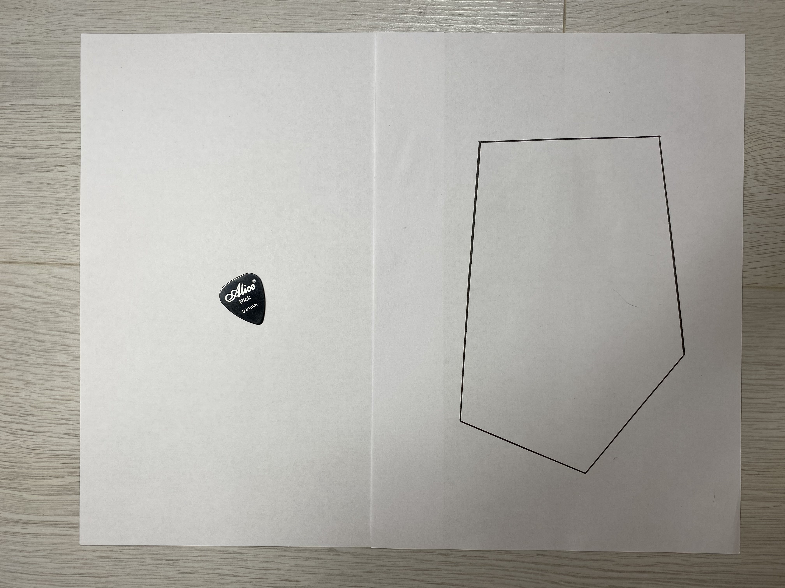
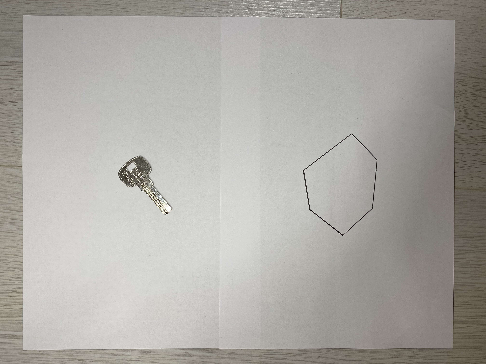
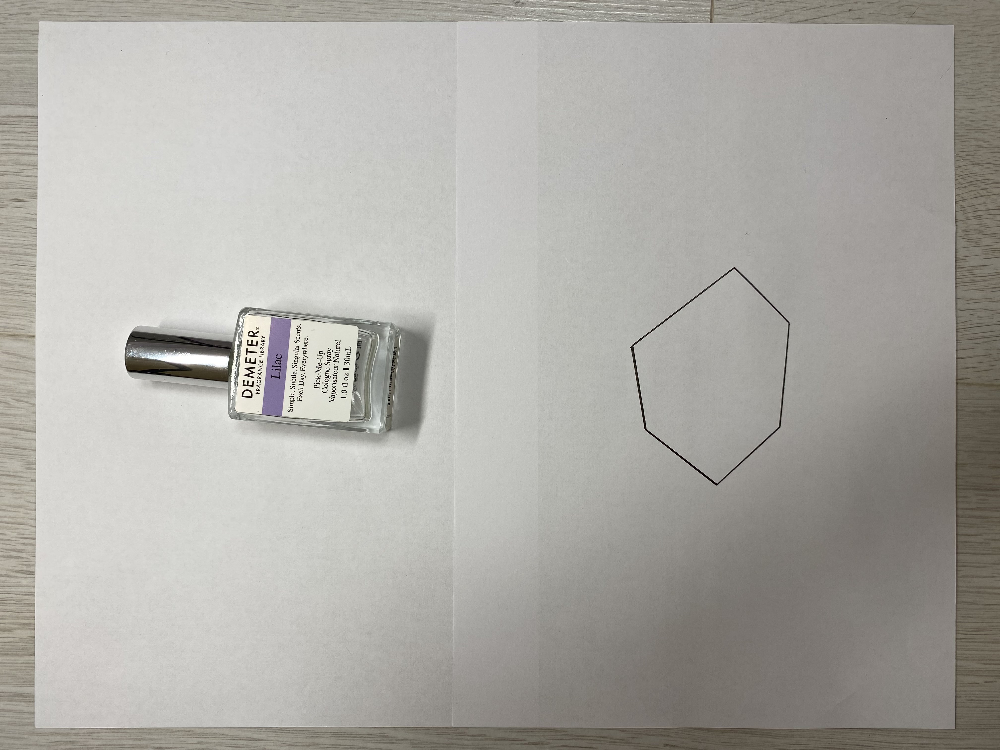
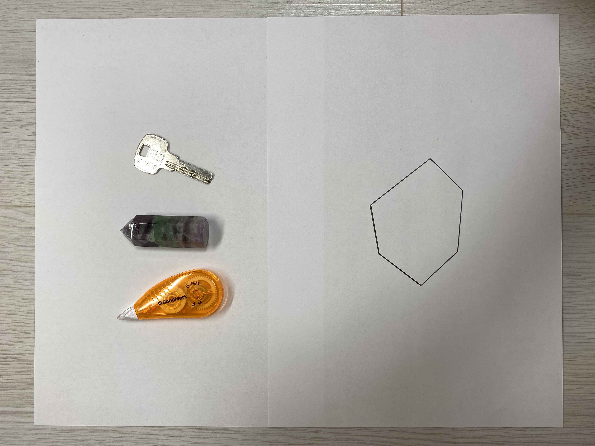
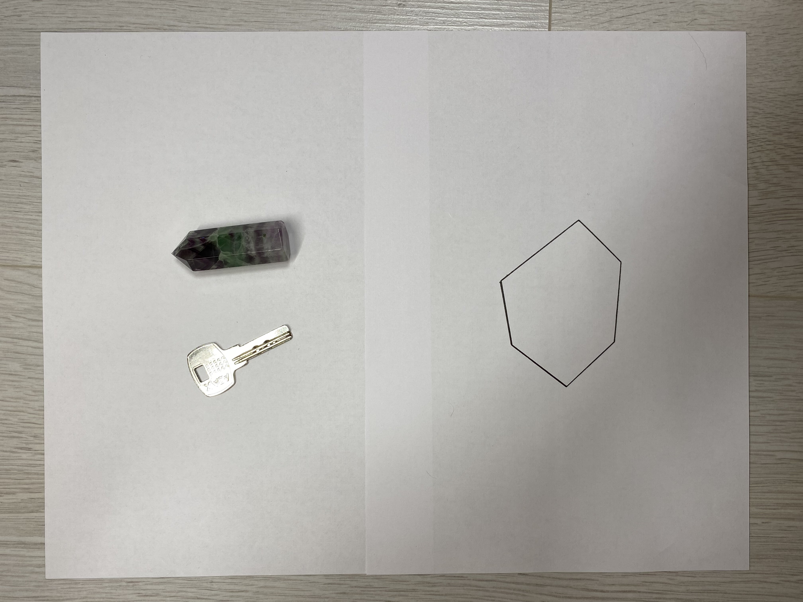
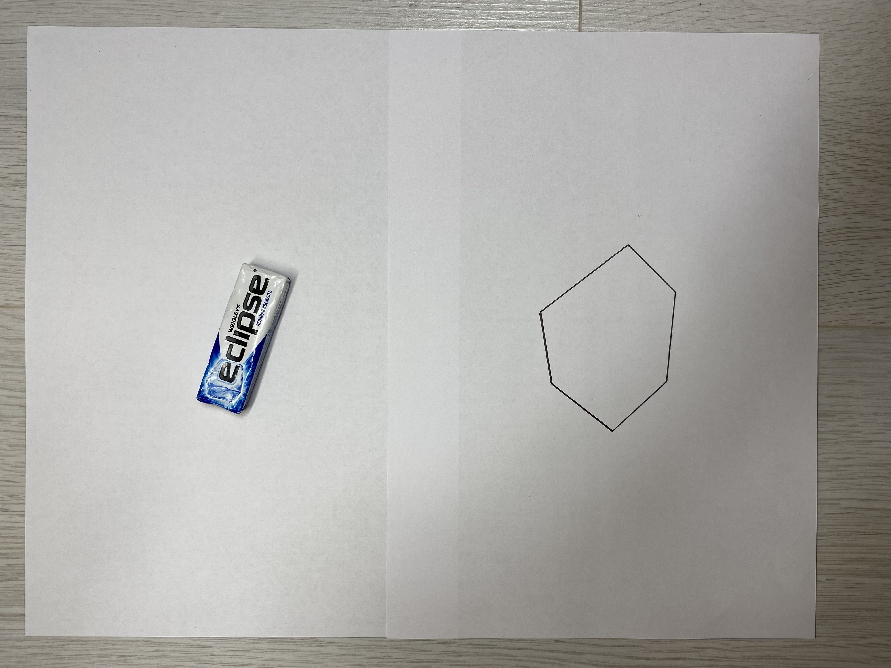
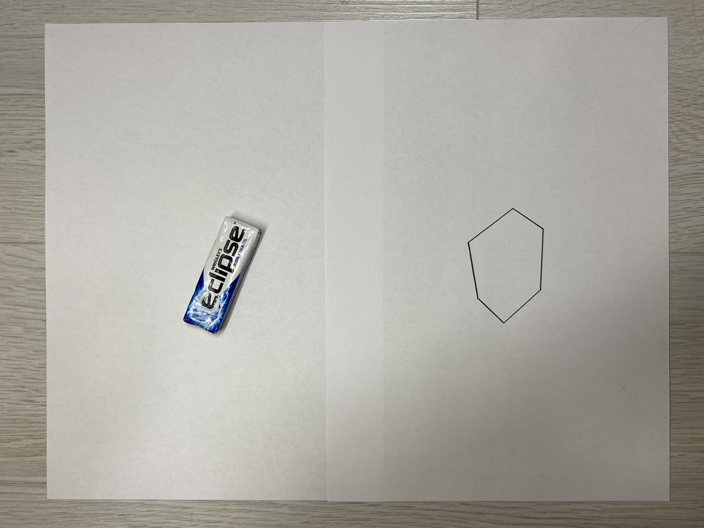
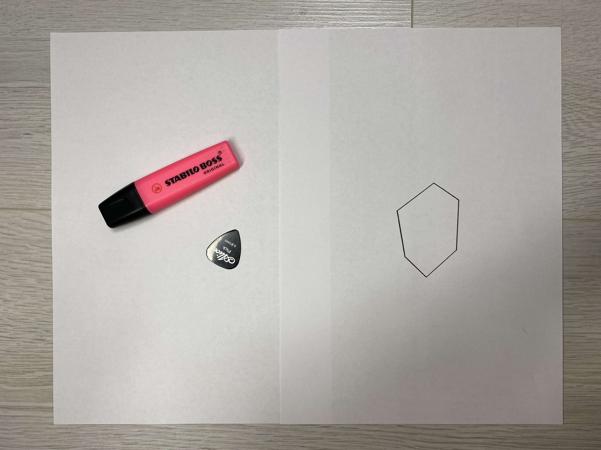
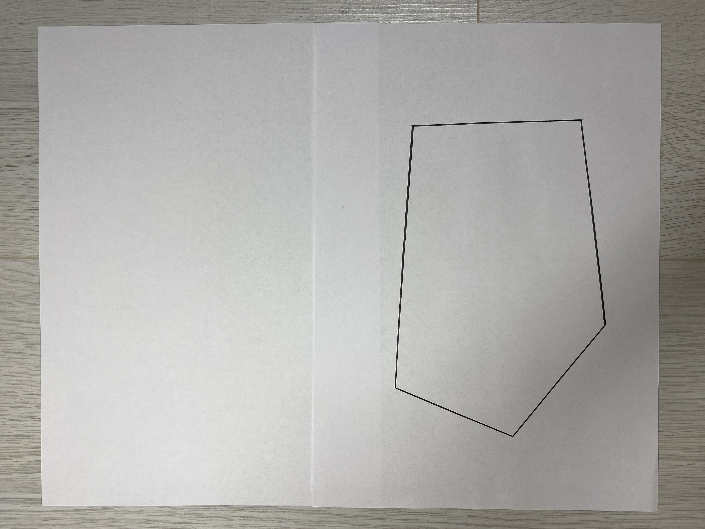
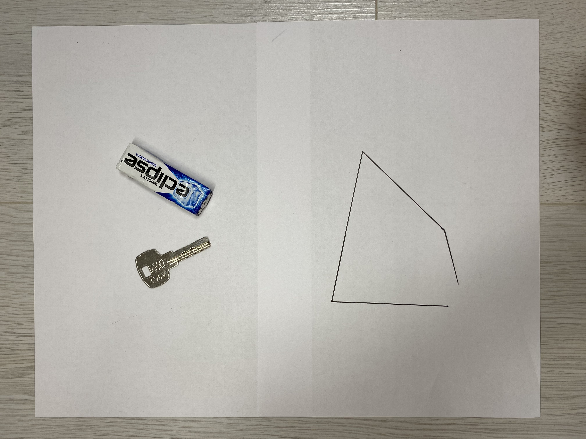

# Тестовые набор данных
Тестовые данные содержат 30 изображений, в данном файле приведено описание самых интересных из них, ожидаемый ответ для остальных изображений приведен в файле expected output.txt
____
1. Предмет очевидно помещается, большой многоугольник — True

2. Оба предмета помещаются и по-отдельности и вместе — True

3. Много предметов, помещаются, но это не так очевидно — True

4. Много предметов, не помещаются, хотя помещаются по-отдельности — False

5. Предмет очевидно помещается, маленький многоугольник — True

6. Предмет очевидно не помещается — False

7. Предметы не помещаются в маленький многоугольник, хотя каждый из них помещается — False

8. Предметы помещаются в маленький многоугольник и по-отдельности и вместе — True

9. Предмет помещается в маленький многоугольник, но это не так очевидно — True

10. Предмет уже не помещается — False

11. Один предмет помещается, но второй — нет — False

12. Изображение не соответствует требованиям — нет многоугольника — False

13. Изображение не соответствует требованиям — нет предметов — False

14. Изображение не соответствует требованиям — многоугольник невыпуклый — False

15. Изображение не соответствует требованиям — ломанная незамкнутая — False
